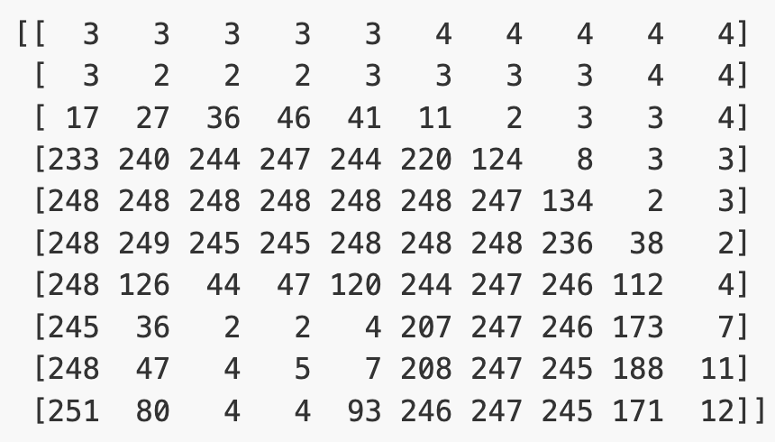
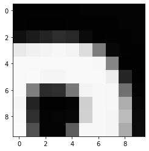

::::::::::::::::::::::::::::::::::::::: objectives

- Visually compare chest X-rays with and without pleural effusion.
- Understand how images are represented as arrays in NumPy.
- Learn to load and preprocess image data for use in machine learning.
- Practice displaying image slices and understanding their pixel-level structure.

::::::::::::::::::::::::::::::::::::::::::::::::::

:::::::::::::::::::::::::::::::::::::::: questions

- How does a chest X-ray with pleural effusion differ from a normal X-ray?
- How is an image represented and manipulated as a NumPy array?
- What steps are needed to prepare images for machine learning?

::::::::::::::::::::::::::::::::::::::::::::::::::

## Visualising the X-rays

In the previous section, we set up a dataset comprising 700 chest X-rays. Half of the X-rays are labelled "normal" and half are labelled as "pleural effusion". Let's take a look at some of the images.

```python
# cv2 is openCV, a popular computer vision library
import cv2
from matplotlib import pyplot as plt 
import random

def plot_example(example, label, loc):
    image = cv2.imread(example)
    im = ax[loc].imshow(image)
    title = f"Class: {label}\n{example}"
    ax[loc].set_title(title)

fig, ax = plt.subplots(1, 2)
fig.set_size_inches(10, 10)

# Plot a "normal" record
plot_example(random.choice(normal_list), "Normal", 0)

# Plot a record labelled with effusion
plot_example(random.choice(effusion_list), "Effusion", 1)
```

{alt='Example X-rays' width="600px"}

:::::::::::::::::::::::::::::::::::::::  challenge

## Exercise

A) Manually classify 10 X-rays using the coin flip code. Make a note of your predictive accuracy (hint: for a
reminder of the formula for accuracy, check the solution below).

:::::::::::::::  solution

## Solution

A) Accuracy is the fraction of predictions that were correct (correct predictions / total predictions).
If you made 10 predictions and 5 were correct, your accuracy is 50%.  


:::::::::::::::::::::::::

::::::::::::::::::::::::::::::::::::::::::::::::::

## Can we detect effusion?

Run the following code to flip a coin to select an x-ray from our collection.

```python
print("Effusion or not?")

# flip a coin
coin_flip = random.choice(["Effusion", "Normal"])
if coin_flip == "Normal":
    fn = random.choice(normal_list)
else:
    fn = random.choice(effusion_list)

# plot the image
image = cv2.imread(fn)
plt.imshow(image)
```

Show the answer:

```python
# Jupyter doesn't allow us to print the image until the cell has run,
# so we'll print in a new cell.
print(f"The answer is: {coin_flip}!")
```

## How does a computer see an image?

Consider an image as a matrix in which the value of each pixel corresponds to a number that determines a tone or color. Let's load one of our images:

```python
import numpy as np 

file_idx = 56
example = normal_list[file_idx]
image = cv2.imread(example)

print(image.shape)
```

```output
(512, 512, 3)
```

Here we see that the image has 3 dimensions. The first dimension is height (512 pixels) and the second is width (also 512 pixels).
The presence of a third dimension indicates that we are looking at a color image ("RGB", or Red, Green, Blue).

For more detail on image representation in Python, take a look at the [Data Carpentry course on Image Processing with Python](https://datacarpentry.org/image-processing/). The following image is reproduced from the [section on Image Representation](https://datacarpentry.org/image-processing/03-skimage-images/index.html).

{alt='RGB image' width="600px"}

For simplicity, we'll instead load the images in greyscale.
A greyscale image has two dimensions: height and width.
Greyscale images have only one channel.
Most greyscale images are 8 bits per channel or 16 bits per channel.
For a greyscale image with 8 bits per channel, each value in the matrix represents a tone between black (0) and white (255).

```python
image = cv2.imread(example, cv2.IMREAD_GRAYSCALE)
print(image.shape)
```

```output
(512, 512)
```

Let's briefly display the matrix of values, and then see how these same values are rendered as an image.

```python
# Print a 10 by 10 chunk of the matrix
print(image[35:45, 30:40])
```

{alt='Example greyscale numpy array' width="400px"}

```python
# Plot the same chunk as an image
plt.imshow(image[35:45, 30:40], cmap='gray', vmin=0, vmax=255)
```

{alt='Example greyscale image' width="400px"}

## Image pre-processing

In the next episode, we'll be building and training a model. Let's prepare our data for the modelling phase. For convenience, we'll begin by loading all of the images and corresponding labels and assigning them to a list.

```python
# create a list of effusion images and labels
dataset_effusion = [cv2.imread(fn, cv2.IMREAD_GRAYSCALE) for fn in effusion_list]
label_effusion = np.ones(len(dataset_effusion))

# create a list of normal images and labels
dataset_normal = [cv2.imread(fn, cv2.IMREAD_GRAYSCALE) for fn in normal_list]
label_normal = np.zeros(len(dataset_normal))

# Combine the lists
dataset = dataset_effusion + dataset_normal
labels = np.concatenate([label_effusion, label_normal])
```

Let's also downsample the images, reducing the size from (512, 512) to (256,256).

```python
# Downsample the images from (512,512) to (256,256)
dataset = [cv2.resize(img, (256,256)) for img in dataset]

# Check the size of the reshaped images
print(dataset[0].shape)

# Normalize the data
# Subtract the mean, divide by the standard deviation.
for i in range(len(dataset)):
  dataset[i] = (dataset[i] - np.average(dataset[i], axis= (0, 1))) / np.std(dataset[i], axis= (0, 1)) 
```

```output
(256, 256)
```

Finally, we'll convert our dataset from a list to an array. We are expecting it to be (700, 256, 256). That is 700 images (350 effusion cases and 350 normal),  each with a dimension of 256 by 256.

```python
dataset = np.asarray(dataset, dtype=np.float32)
print(f"Matrix Dimensions: {dataset.shape}")
```

```output
(700, 256, 256)
```

We could plot the images by indexing them on `dataset`, e.g., we can plot the first image in the dataset with:

```python
idx = 0
vals = dataset[idx].flatten()
plt.imshow(dataset[idx], cmap='gray', vmin=min(vals), vmax=max(vals))
```

{alt='Example greyscale image' width="400px"}


:::::::::::::::::::::::::::::::::::::::: keypoints

- Chest X-rays can be visualized and interpreted using standard image libraries like OpenCV and Matplotlib.
- In NumPy, grayscale images are stored as 2D arrays and RGB images as 3D arrays.
- Visual inspection helps us understand how disease features appear in imaging data.
- Preprocessing steps such as resizing and normalization are essential before training models.

::::::::::::::::::::::::::::::::::::::::::::::::::


