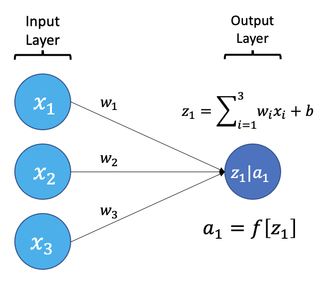
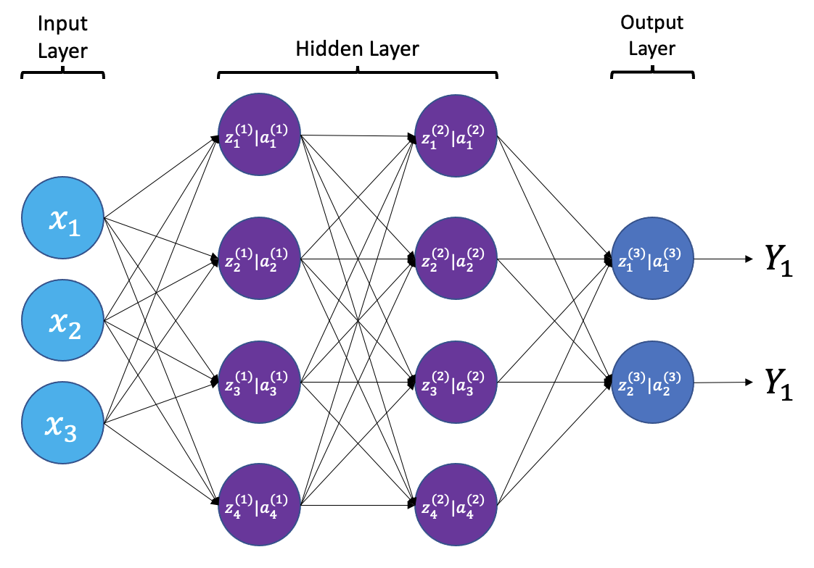
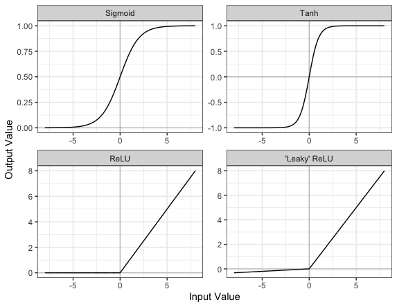

::::::::::::::::::::::::::::::::::::::: objectives

- Understand the structure and components of a neural network.
- Identify the purpose of activation functions and dense layers.
- Explain how convolutional layers extract features from images.
- Construct a convolutional neural network using TensorFlow and Keras.

::::::::::::::::::::::::::::::::::::::::::::::::::


:::::::::::::::::::::::::::::::::::::::: questions

- What is a neural network and how is it structured?
- What role do activation functions play in learning?
- What is the difference between dense and convolutional layers?
- Why are convolutional neural networks effective for image classification?

::::::::::::::::::::::::::::::::::::::::::::::::::


## What is a neural network?

An artificial neural network, or just "neural network", is a broad term that describes a family of machine learning models that are (very!) loosely based on the neural circuits found in biology.

The smallest building block of a neural network is a single neuron. A typical neuron receives inputs (x1, x2, x3) which are multiplied by learnable weights (w1, w2, w3), then summed with a bias term (b). An activation function (f) determines the neuron output.

{alt='Neuron' width="600px"}

From a high level, a neural network is a system that takes input values in an "input layer", processes these values with a collection of functions in one or more "hidden layers", and then generates an output such as a prediction. The network has parameters that are systematically tweaked to allow pattern recognition.

{alt='Neuron' width="800px"}

The layers shown in the network above are "dense" or "fully connected". Each neuron is connected to all neurons in the preceeding layer. Dense layers are a common building block in neural network architectures.

"Deep learning" is an increasingly popular term used to describe certain types of neural network. When people talk about deep learning they are typically referring to more complex network designs, often with a large number of hidden layers.

## Activation Functions

Part of the concept of a neural network is that each neuron can either be 'active' or 'inactive'. This notion of activity and inactivity is attempted to be replicated by so called activation functions. The original activation function was the sigmoid function (related to its use in logistic regression). This would make each neuron's activation some number between 0 and 1, with the idea that 0 was 'inactive' and 1 was 'active'.

As time went on, different activation functions were used. For example the tanh function (hyperbolic tangent function), where the idea is a neuron can be active in both a positive capacity (close to 1), a negative capacity (close to -1) or can be inactive (close to 0).

The problem with both of these is that they suffered from a problem called [model saturation](https://vigir.missouri.edu/~gdesouza/Research/Conference_CDs/IEEE_SSCI_2015/data/7560b423.pdf). This is where very high or very low values are put into the activation function, where the gradient of the line is almost flat. This leads to very slow learning rates (it can take a long time to train models with these activation functions).

One popular activation function that tries to tackle this is the rectified linear unit (ReLU) function. This has 0 if the input is negative (inactive) and just gives back the input if it is positive (a measure of how active it is - the metaphor gets rather stretched here). This is much faster at training and gives very good performance, but still suffers model saturation on the negative side. Researchers have tried to get round this with functions like 'leaky' ReLU, where instead of returning 0, negative inputs are multiplied by a very small number.

{alt='Activation functions' width="600px"}

## Convolutional neural networks

Convolutional neural networks (CNNs) are a type of neural network that especially popular for vision tasks such as image recognition. CNNs are very similar to ordinary neural networks, but they have characteristics that make them well suited to image processing.

Just like other neural networks, a CNN typically consists of an input layer, hidden layers and an output layer. The layers of "neurons" have learnable weights and biases, just like other networks.

What makes CNNs special? The name stems from the fact that the architecture includes one or more convolutional layers. These layers apply a mathematical operation called a "convolution" to extract features from arrays such as images.

In a convolutional layer, a matrix of values referred to as a "filter" or "kernel" slides across the input matrix (in our case, an image). As it slides, values are multiplied to generate a new set of values referred to as a "feature map" or "activation map".

{alt='2D Convolution Animation by Michael Plotke' width="500px"}

Filters provide a mechanism for emphasising aspects of an input image. For example, a filter may emphasise object edges. See [setosa.io](https://setosa.io/ev/image-kernels/) for a visual demonstration of the effect of different filters.

## Max pooling

Convolutional layers often produce large feature maps — one for each filter. To reduce the size of these maps while retaining the most important features, we use **pooling**.

The most common type is **max pooling**. It works by sliding a small window (often 2×2) across the feature map and taking the **maximum value** in each region. This reduces the resolution of the feature map (for a 2x2 window by a factor of 2) while keeping the strongest responses.

For example, if we apply max pooling to the following 4×4 matrix:

```
[1, 3, 2, 1],
[5, 6, 1, 2],
[4, 2, 9, 8],
[3, 1, 2, 0]
```

We get this 2×2 output:

```
[6, 2],
[4, 9]
```

Each value in the output is the maximum from a 2×2 window in the input.

### Why use max pooling?

- **Reduces computation** by shrinking the feature maps
- **Adds translation tolerance** — the model is less sensitive to small shifts in the image
- **Keeps the strongest features** while discarding low-importance details

In TensorFlow, max pooling is implemented with the `MaxPool2D()` layer. You'll see it applied multiple times in our network to gradually reduce the size of the feature maps and focus on the most prominent features.

## Dropout

When training neural networks, a common problem is overfitting — the model learns to perform very well on the training data but fails to generalize to new, unseen examples.

Dropout is a regularization technique that helps reduce overfitting. During training, dropout temporarily "drops out" (sets to zero) a random subset of neurons in a layer. This forces the network to learn redundant representations and prevents it from becoming too reliant on any single path through the network.

In practice:

- During training: a random set of neurons is deactivated at each step.
- During inference (prediction), all neurons are used, and the outputs are scaled accordingly.

For example:

```python
from tensorflow.keras.layers import Dropout

x = Dense(128, activation='relu')(x)
# Drop 50% of neurons during training
x = Dropout(0.5)(x)
```

The value 0.5 is the dropout rate — the fraction of neurons to disable.

::::::::::::::::::::::::::::::::::::::: challenge

A) Why is dropout helpful during training?
B) What effect do you expect from reducing or removing the dropout rate during training?

::::::::::::::: solution

A) Dropout randomly disables neurons during training, forcing the network to not rely too heavily on any one path. This helps prevent overfitting and improves generalization.

B) With lower or no dropout, training accuracy may rise faster, but validation accuracy may stagnate or decline, indicating overfitting.

:::::::::::::::::::::::::

:::::::::::::::::::::::::::::::::::::::

## Creating a convolutional neural network

Before training a convolutional neural network, we will first define its architecture. The architecture we use in this lesson is intentionally simple. It follows common CNN design principles:

- Repeated use of small convolutional filters (3×3 or 5×5)
- Max pooling to reduce dimensionality
- Fully connected layers at the end for classification

This architecture is loosely inspired by classic CNNs such as LeNet-5 and VGGNet. It strikes a balance between performance and clarity. It’s small enough to train on a CPU, but expressive enough to learn meaningful features from medical images.

More complex architectures (like DenseNet) are used in real-world medical imaging applications. But for a small dataset and classroom setting, our custom architecture is ideal for learning.

To make this process modular and reusable, we’ll write a function called `build_model()` using TensorFlow and Keras.

```python
from tensorflow.keras.models import Model
from tensorflow.keras.layers import (
    Input, Conv2D, MaxPool2D,
    GlobalAveragePooling2D, Dense, Dropout
)

def build_model(input_shape=(256, 256, 1), dropout_rate=0.6):
    """
    Build and return a convolutional neural network with explanatory comments.

    Args:
        input_shape (tuple): Shape of the input images (H, W, Channels).
        dropout_rate (float): Dropout rate to use before final dense layers.

    Returns:
        model (tf.keras.Model): Compiled Keras model.
    """
    # Define the input layer matching the shape of the images.
    inputs = Input(shape=input_shape)

    # First convolutional layer: applies 8 filters (3x3), followed by max pooling
    # Padding='same' keeps the output size the same as the input.
    x = Conv2D(filters=8, kernel_size=3, padding='same', activation='relu')(inputs)
    x = MaxPool2D()(x)

    # Add a second convolutional layer + pooling
    x = Conv2D(filters=8, kernel_size=3, padding='same', activation='relu')(x)
    x = MaxPool2D()(x)

    # Add two more convolutional layers with 12 filters, extracting more complex features
    x = Conv2D(filters=12, kernel_size=3, padding='same', activation='relu')(x)
    x = MaxPool2D()(x)
    x = Conv2D(filters=12, kernel_size=3, padding='same', activation='relu')(x)
    x = MaxPool2D()(x)

    # Increase the filter size and depth (20 filters, 5x5 kernel)
    x = Conv2D(filters=20, kernel_size=5, padding='same', activation='relu')(x)
    x = MaxPool2D()(x)
    x = Conv2D(filters=20, kernel_size=5, padding='same', activation='relu')(x)
    x = MaxPool2D()(x)

    # Final convolutional layer with 50 filters
    x = Conv2D(filters=50, kernel_size=5, padding='same', activation='relu')(x)

    # Global average pooling reduces each feature map to a single value
    x = GlobalAveragePooling2D()(x)

    # Dense (fully connected) layer with 128 neurons for classification
    # Dropout applied to the 128 activations from the Dense layer
    x = Dense(128, activation='relu')(x)
    x = Dropout(dropout_rate)(x)

    # Another dense layer with 32 neurons
    x = Dense(32, activation='relu')(x)

    # Final output layer: a single neuron with sigmoid activation (for binary classification)
    outputs = Dense(1, activation='sigmoid')(x)

    # Build the model
    model = Model(inputs=inputs, outputs=outputs)
    return model
```

:::::::::::::::::::::::::::::::::::::::  challenge

## Exercise

A) What is the purpose of using multiple convolutional layers in a neural network?  
B) What would happen if you skipped the pooling layers entirely?  

:::::::::::::::  solution

## Solution

A) Stacking convolutional layers allows the network to learn increasingly abstract features — early layers detect edges and textures, while later layers detect shapes or patterns.

B) Skipping pooling layers means the model retains high-resolution spatial information, but it increases computational cost and can lead to overfitting.

:::::::::::::::::::::::::

::::::::::::::::::::::::::::::::::::::::::::::::::

Now let's build the model and view its architecture:

```python
from tensorflow.random import set_seed

# Set the seed for reproducibility
set_seed(42)

# Call the build_model function to create the model
model = build_model(input_shape=(256, 256, 1), dropout_rate=0.6)

# View the model architecture
model.summary()
```

```output
Model: "model_39"
_________________________________________________________________
 Layer (type)                Output Shape              Param #   
=================================================================
 input_9 (InputLayer)        [(None, 256, 256, 1)]     0         
                                                                 
 conv2d_59 (Conv2D)          (None, 256, 256, 8)       80        
                                                                 
 max_pooling2d_50 (MaxPoolin  (None, 128, 128, 8)      0         
 g2D)                                                            
                                                                 
 conv2d_60 (Conv2D)          (None, 128, 128, 8)       584       
                                                                 
 max_pooling2d_51 (MaxPoolin  (None, 64, 64, 8)        0         
 g2D)                                                            
                                                                 
 conv2d_61 (Conv2D)          (None, 64, 64, 12)        876       
                                                                 
 max_pooling2d_52 (MaxPoolin  (None, 32, 32, 12)       0         
 g2D)                                                            
                                                                 
 conv2d_62 (Conv2D)          (None, 32, 32, 12)        1308      
                                                                 
 max_pooling2d_53 (MaxPoolin  (None, 16, 16, 12)       0         
 g2D)                                                            
                                                                 
 conv2d_63 (Conv2D)          (None, 16, 16, 20)        6020      
                                                                 
 max_pooling2d_54 (MaxPoolin  (None, 8, 8, 20)         0         
 g2D)                                                            
                                                                 
 conv2d_64 (Conv2D)          (None, 8, 8, 20)          10020     
                                                                 
 max_pooling2d_55 (MaxPoolin  (None, 4, 4, 20)         0         
 g2D)                                                            
                                                                 
 conv2d_65 (Conv2D)          (None, 4, 4, 50)          25050     
                                                                 
 global_average_pooling2d_8   (None, 50)               0         
 (GlobalAveragePooling2D)                                        
                                                                 
 dense_26 (Dense)            (None, 128)               6528      
                                                                 
 dropout_8 (Dropout)         (None, 128)               0         
                                                                 
 dense_27 (Dense)            (None, 32)                4128      
                                                                 
 dense_28 (Dense)            (None, 1)                 33        
                                                                 
=================================================================
Total params: 54,627
Trainable params: 54,627
Non-trainable params: 0
_________________________________________________________________
```

:::::::::::::::::::::::::::::::::::::::  challenge

## Exercise

Increase the number of filters in the first convolutional layer from 8 to 16.  

- How does this affect the number of parameters in the model?
- What effect do you expect this change to have on the model’s learning capacity?

:::::::::::::::  solution

## Solution

In the `build_model()` function, locate this line:

```python
x = Conv2D(filters=8, kernel_size=3, padding='same', activation='relu')(inputs)
```

Change it to:

```python
x = Conv2D(filters=16, kernel_size=3, padding='same', activation='relu')(inputs)
```

This increases the number of filters (feature detectors), and therefore increases the number of learnable parameters. The model may be able to capture more features, improving learning, but it also risks overfitting and will take longer to train.

:::::::::::::::::::::::::

::::::::::::::::::::::::::::::::::::::::::::::::::


:::::::::::::::::::::::::::::::::::::::: keypoints

- Neural networks are composed of layers of neurons that transform inputs into outputs through learnable parameters.
- Activation functions introduce non-linearity and help neural networks learn complex patterns.
- Dense (fully connected) layers connect every neuron from one layer to the next and are commonly used in classification tasks.
- Convolutional layers apply filters to extract spatial features from images and are the core of convolutional neural networks (CNNs).
- Dropout helps reduce overfitting by randomly disabling neurons during training.

::::::::::::::::::::::::::::::::::::::::::::::::::


