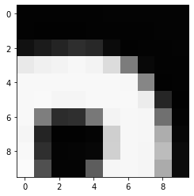

## Visualising the X-rays

In the previous section, we set up a dataset comprising 700 chest X-rays. Half of the X-rays are labelled "normal" and half are labelled as "pleural effusion". Let's take a look at some of the images.

```python
# cv2 is openCV, a popular computer vision library
import cv2
from matplotlib import pyplot as plt 

def plot_example(example, label, loc):
    image = cv2.imread(example)
    im = ax[loc].imshow(image)
    title = f"Class: {label}\n{example}"
    ax[loc].set_title(title)

fig, ax = plt.subplots(1, 2)
fig.set_size_inches(10, 10)

# Plot a "normal" record
# (select a file from the list using its index)
file_idx = 0
plot_example(normal_list[file_idx], "Normal", 0)

# Plot a record labelled with effusion
plot_example(effusion_list[file_idx], "Effusion", 1)
```
{: .language-python}

{: width="600px"}

## How does a computer see an image?

Consider an image as a matrix in which the value of each pixel corresponds to a number that determines a tone or color. Let's load one of our images:

```python
import numpy as np 

file_idx = 56
example = normal_list[file_idx]
image = cv2.imread(example)

print(image.shape)
```
{: .language-python}

```
(512, 512, 3)
```
{: .output}

Here we see that the image has 3 dimensions. The first dimension is height (512 pixels) and the second is width (also 512 pixels). 
The presence of a third dimension indicates that we are looking at a color image ("RGB", or Red, Green, Blue).

For more detail on image representation in Python, take a look at the [Data Carpentry course on Image Processing with Python](https://datacarpentry.org/image-processing/). The following image is reproduced from the [section on Image Representation](https://datacarpentry.org/image-processing/03-skimage-images/index.html).

{: width="600px"}

For simplicity, we'll instead load the images in greyscale. A greyscale image has two dimensions: height and width. Each value in the matrix represents a tone between black (0) and white (255).

```python
image = cv2.imread(example, cv2.IMREAD_GRAYSCALE)
print(image.shape)
```
{: .language-python}

```
(512, 512)
```
{: .output}

Let's briefly display the matrix of values, and then see how these same values are rendered as an image.

```python
# Print a 10 by 10 chunk of the matrix
print(image[35:45, 30:40])
```
{: .language-python}

{: width="400px"}

```python
# Plot the same chunk as an image
plt.imshow(image[35:45, 30:40], cmap='gray', vmin=0, vmax=255)
```
{: .language-python}

{: width="400px"}

## Image pre-processing

In the next episode, we'll be building and training a model. Let's prepare our data for the modelling phase. For convenience, we'll begin by loading all of the images and corresponding labels and assigning them to a list.

```python
# create a list of effusion images and labels
dataset_effusion = [cv2.imread(fn, cv2.IMREAD_GRAYSCALE) for fn in effusion_list]
label_effusion = np.ones(len(dataset_effusion))

# create a list of normal images and labels
dataset_normal = [cv2.imread(fn, cv2.IMREAD_GRAYSCALE) for fn in normal_list]
label_normal = np.zeros(len(dataset_normal))

# Combine the lists
dataset = dataset_effusion + dataset_normal
labels = np.concatenate([label_effusion, label_normal])
```
{: .language-python}

Let's also downsample the images, reducing the size from (512, 512) to (256,256).

```python
# Downsample the images from (512,512) to (256,256)
dataset = [cv2.resize(img, (256,256)) for img in dataset]

# Check the size of the reshaped images
print(dataset[0].shape)

# Normalization decreases the dataset's variability.
for i in range(len(dataset)):
  # we will do the normalization, dividing the mean by the standard deviation
  dataset[i] = (dataset[i] - np.average(dataset[i], axis= (0, 1))) / np.std(dataset[i], axis= (0, 1)) 
```
{: .language-python}

```
(256, 256)
```
{: .output}

Finally, we'll convert our dataset from a list to an array. We are expecting it to be (700, 256, 256). That is 700 images (350 effusion cases and 350 normal),  each with a dimension of 256 by 256.

```python
dataset = np.asarray(dataset, dtype=np.float32)
print(f"Matrix Dimensions: {dataset.shape}")
```

```
(700, 256, 256)
```
{: .output}

We could plot the images by indexing them on `dataset`, e.g., we can plot the first image in the dataset with:

```python
idx = 0
vals = dataset[idx].flatten()
plt.imshow(dataset[idx], cmap='gray', vmin=min(vals), vmax=max(vals))
```
{: .language-python}

{: width="400px"}


 


