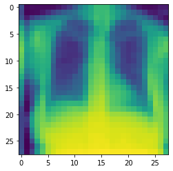
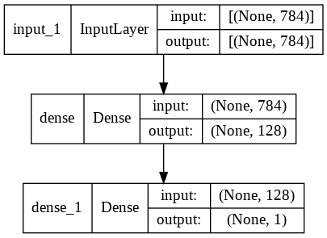

## Learning to recognise disease in X-rays

Pneumonia is an infection of one or both of the lungs. When someone has pneumonia, the lungs are inflamed and may be partially filled with fluid. Symptoms often include difficulty breathing, chest pain, cough, and fatigue.

A chest radiograph - or chest X-ray - is an image of the chest used to diagnose conditions affecting the heart and lungs such as pneumonia. One of the signs of pneumonia is an increased whiteness in the lungs as a result of increased density.

The following chest X-ray shows signs of pneumonia. 

{: width="600px"}

Compare the X-ray above with the following X-ray without the whiteness:

{: width="600px"}

## Loading our dataset

We will train a neural network to detect chest X-rays with signs of pneumonia. To reduce the computational complexity of the task, we will use a collection of frontal-view X-rays that have been pre-processed to 28x28 pixels. We'll begin by loading the dataset and viewing the metadata.

```python
import medmnist

dataset = 'chestmnist'
metadata = medmnist.INFO[dataset]
print(metadata)
```

```
{'MD5': '02c8a6516a18b556561a56cbdd36c4a8',
 'description': 'The ChestMNIST is based on the NIH-ChestXray14 dataset, a dataset comprising 112,120 frontal-view X-Ray images of 30,805 unique patients with the text-mined 14 disease labels, which could be formulized as a multi-label binary-class classification task. We use the official data split, and resize the source images of 1×1024×1024 into 1×28×28.',
 'label': {'0': 'atelectasis',
  '1': 'cardiomegaly',
  '10': 'emphysema',
  '11': 'fibrosis',
  '12': 'pleural',
  '13': 'hernia',
  '2': 'effusion',
  '3': 'infiltration',
  '4': 'mass',
  '5': 'nodule',
  '6': 'pneumonia',
  '7': 'pneumothorax',
  '8': 'consolidation',
  '9': 'edema'},
 'license': 'CC0 1.0',
 'n_channels': 1,
 'n_samples': {'test': 22433, 'train': 78468, 'val': 11219},
 'python_class': 'ChestMNIST',
 'task': 'multi-label, binary-class',
 'url': 'https://zenodo.org/record/5208230/files/chestmnist.npz?download=1'}
```
{: .output}

Now let's download the dataset and view an example.


```python
from matplotlib import pyplot as plt

train_dataset = medmnist.ChestMNIST(split='train', download=True)
test_dataset = medmnist.ChestMNIST(split='test', download=True)
sample_image = train_dataset.imgs[0]

plt.imshow(sample_image)
plt.show()
```

{: width="300px"}

Viewing the content of the `sample_image` variable, we can see that the image is a rendering of a 28x28 array of numerical values that represent a colour density at each pixel.

```python
print(sample_image)
```

```
array([[ 61,   9,  13,  12,  12,  12,  13,  19,  31,  45,  70, 103, 123,
        143, 162, 162, 162, 143, 117,  97,  64,  40,  21,  13,  11,  13,
         21,  22],
       [ 54,   7,  10,  12,  20,  34,  48,  62,  74,  83,  92, 116, 131,
        145, 163, 162, 164, 148, 131, 115,  93,  80,  65,  44,  24,  21,
         29,  34],
       ...
```
{: .output}

We can also view the distribution of classes in the training set:

```python
import pandas as pd

# convert labels to dataframe
df = pd.DataFrame(data=train_dataset.labels, 
                  columns=train_dataset.info['label'].values())
print(df.sum())
```

```
atelectasis       7996
cardiomegaly      1950
effusion          9261
infiltration     13914
mass              3988
nodule            4375
pneumonia          978
pneumothorax      3705
consolidation     3263
edema             1690
emphysema         1799
fibrosis          1158
pleural           2279
hernia             144
dtype: int64
```
{: .output}

## Data preparation

Now that we have our raw data, we need to prepare it for inputting into our (yet to be created!) neural network. 

[TODO: work out a cleaner way of subsetting the dataset]

```python
# add pneumonia flag
train_dataset.pneumonia = (train_dataset.labels[:,6] == 1) & (train_dataset.labels.sum(axis=1) == 1)
test_dataset.pneumonia = (test_dataset.labels[:,6] == 1) & (test_dataset.labels.sum(axis=1) == 1)

# add "normal" flag
train_dataset.normal = (train_dataset.labels.sum(axis=1) == 0)
test_dataset.normal = (test_dataset.labels.sum(axis=1) == 0)

# subset to first 1000 "normal"
train_dataset.normal = train_dataset.normal & (train_dataset.normal.astype(int).cumsum() < 1000)
test_dataset.normal = test_dataset.normal & (test_dataset.normal.astype(int).cumsum() < 1000)

# remove anything that isn't pneumonia or normal
train_idx_subset = (train_dataset.pneumonia | train_dataset.normal)
test_idx_subset = (test_dataset.pneumonia | test_dataset.normal)

train_dataset.pneumonia = train_dataset.pneumonia[train_idx_subset]
test_dataset.pneumonia = test_dataset.pneumonia[test_idx_subset]
train_dataset.imgs = train_dataset.imgs[train_idx_subset]
test_dataset.imgs = test_dataset.imgs[test_idx_subset]
train_dataset.labels = train_dataset.labels[train_idx_subset]
test_dataset.labels = test_dataset.labels[test_idx_subset]
```

[TODO: introduce tensorflow and concept of tensor]

First we'll flatten our 2D images into 1D vectors and normalise the values on 0-1 scale. `train_dataset.imgs` contains our images and ` train_dataset.labels` contains the associated labels.

```python
# Flatten into 1D vectors
train_dataset.imgs = train_dataset.imgs.reshape(-1, 28*28)
test_dataset.imgs = test_dataset.imgs.reshape(-1, 28*28)

# Convert type and normalise
train_dataset.imgs = train_dataset.imgs.astype("float32") / 255.0
test_dataset.imgs = test_dataset.imgs.astype("float32") / 255.0
print(train_dataset.imgs[0])
```

```
[0.23921569 0.03529412 0.05098039 0.04705882 0.04705882 0.04705882
 0.05098039 0.07450981 0.12156863 0.1764706  0.27450982 0.40392157
 0.48235294 0.56078434 0.63529414 0.63529414 0.63529414 0.56078434
 0.45882353 0.38039216 0.2509804  0.15686275 0.08235294 0.05098039
 0.04313726 0.05098039 0.08235294 0.08627451 0.21176471 0.02745098
 ... ]
```
{: .output}

## Creating the neural network

Instead of coding the network from scratch, we will use building blocks from the TensorFlow library to create a straightforward, sequential network. Our model will comprise of a stack of three layers: an input layer that takes our 28x28 set of features, a hidden layer with 10 neurons, and an output layer with the number of neurons matching our classes.

We are using "Dense" layers, one of the most commonly used types of layer. By dense, we mean that each layer in the neural network receives input from all neurons in the previous layer (hence their alternative name, the fully-connected layer). `Flatten` reshapes our input matrix into a single 28x28 vector.

[TODO: introduce softmax]

```python
import tensorflow as tf

# Create a `Sequential` model with a single hidden layer
model = tf.keras.models.Sequential()

# Add an input layer
input_shape = (28*28)
model.add(tf.keras.layers.Input(shape=input_shape))

# Add hidden layer
n_hidden_layer_1 = 128
model.add(tf.keras.layers.Dense(n_hidden_layer_1, activation=tf.nn.relu))

# Add a binary output layer
n_output = 1
model.add(tf.keras.layers.Dense(n_output))
```

## Defining the loss function and optimizer

[TODO: introduce loss function and optimizer]


```python
model.compile(
    loss=tf.losses.BinaryCrossentropy(from_logits=True),
    optimizer=tf.keras.optimizers.Adam(learning_rate=0.001),
    metrics=['accuracy']
)
```

## Review the model architecture

[TODO: introduce the plot]

```python
tf.keras.utils.plot_model(model, show_shapes=True)
```

{: width="400px"}

## Train the model

We now call the `fit()` method on the training data to train our network. 

```python
model.fit(
    train_dataset.imgs,
    train_dataset.pneumonia,
    batch_size=128,
    epochs=400,
    verbose=2,
    shuffle=True
)
```

[TODO: plot metrics]

## Evaluation

As a more robust test, let's evaluate the model on our full test set.

```python
score_train = model.evaluate(train_dataset.imgs, train_dataset.pneumonia, verbose=0)
print("Train loss:", score_train[0])
print("Train accuracy:", score_train[1])

score_test = model.evaluate(test_dataset.imgs, test_dataset.pneumonia, verbose=0)
print("Test loss:", score_test[0])
print("Test accuracy:", score_test[1])
```



