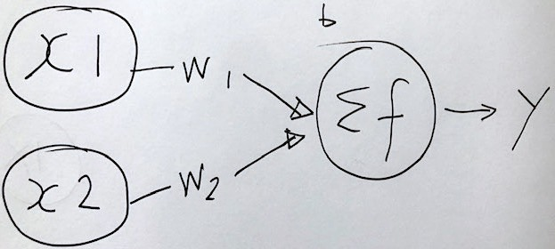
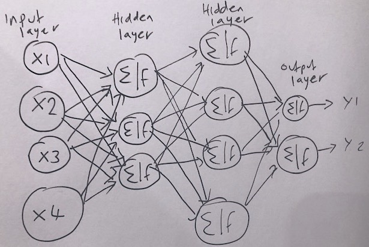

## What is a neural network?

An artificial neural network, or just “neural network”, is a broad term that describes a family of machine learning models that are (very!) loosely based on the neural circuits found in biology.

The smallest building block of a neural network is a single neuron. A typical neuron receives inputs (x1, x2) which are multiplied by learnable weights (w1, w2), then summed with a bias term (b). An activation function determines the neuron output.

{: width="600px"}

From a high level, a neural network is a system that takes input values in an “input layer”, processes these values with a collection of functions in one or more “hidden layers”, and then generates an output such as a prediction. The network has parameters that are systematically tweaked to allow pattern recognition.

{: width="800px"}

“Deep learning” is an increasingly popular term used to describe neural networks. When people talk about deep learning they are typically referring to more complex network designs, often with a large number of hidden layers.

## Convolutional neural networks

Convolutional neural networks (CNNs) are a type of neural network that especially popular for vision tasks such as image recognition. CNNs are very similar to ordinary neural networks, but they have characteristics that make them well suited to image processing.

Just like other neural networks, a CNN typically consists of an input layer, hidden layers and an output layer. The layers of "neurons" have learnable weights and biases, just like other networks.

What makes CNNs special? The name stems from the fact that the architecture includes one or more convolutional layers. These layers apply a mathematical operation called a "convolution" to extract features from arrays such as images.

In a convolutional layer, a matrix of values referred to as a "filter" or "kernel" slides across the input matrix (such as an image). As it slides, the values are multiplied to generate a new set of values referred to as a "feature map" or "activation map".

{: width="800px"}

Different filters allow different aspects of an input image to be emphasised. For example, certain filters may help to identify the edges of objects in an image.

## Creating a convolutional neural network

Before training a convolutional neural network, we will first need to define the architecture. We can do this using the Keras and Tensorflow libraries.

```python
# Create the architecture of our convolutional neural network, using
# the tensorflow library
import tensorflow as tf

# set random seed for reproducibility
tf.random.set_seed(42)

from tensorflow.keras import optimizers
from tensorflow.keras.layers import Dense, Dropout, Conv2D, MaxPool2D, Input, add, GlobalAveragePooling2D
from tensorflow.keras.models import Model
from tensorflow.keras.callbacks import ModelCheckpoint
import tensorflow as tf
 
# Our input layer should match the input shape of our images.
# A CNN takes tensors of shape (image_height, image_width, color_channels)
# We ignore the batch size when describing the input layer
# Our input images are 256 by 256, plus a single colour channel.
inputs = Input(shape=(256, 256, 1))

# Let's add the first convolutional layer
x = Conv2D(8, 3, padding='same', activation='relu')(inputs)

# MaxPool layers are similar to convolution layers. 
# The pooling operation involves sliding a two-dimensional filter over each channel of feature map and summarising the features.
# We do this to reduce the dimensions of the feature maps, helping to limit the amount of computation done by the network.
x = MaxPool2D()(x)

# We will add more convolutional layers, followed by MaxPool
x = Conv2D(8, 3, padding='same', activation='relu')(x)
x = MaxPool2D()(x)
x = Conv2D(12, 3, padding='same', activation='relu')(x)
x = MaxPool2D()(x)
x = Conv2D(12, 3, padding='same', activation='relu')(x)
x = MaxPool2D()(x)
x = Conv2D(20, 5, padding='same', activation='relu')(x)
x = MaxPool2D()(x)
x = Conv2D(20, 5, padding='same', activation='relu')(x)
x = MaxPool2D()(x)
x = Conv2D(50, 5, padding='same', activation='relu')(x)
x = GlobalAveragePooling2D()(x)

# Finally we will add two "dense" or "fully connected layers".
# Dense layers help with the classification task, after features are extracted.
x = Dense(128, activation='relu')(x)

# Dropout is a technique to help prevent overfitting that involves deleting neurons.
x = Dropout(0.6)(x)

x = Dense(32, activation='relu')(x)

# Our final dense layer has a single output to match the output classes.
# If we had multi-classes we would match this number to the number of classes.
outputs = Dense(1, activation='sigmoid')(x)

# Finally, we will define our network with the input and output of the network
model = Model(inputs=inputs, outputs=outputs)
```
{: .language-python}

We can view the architecture of the model:

```python
model.summary()
```
{: .language-python}

```
Model: "model_39"
_________________________________________________________________
 Layer (type)                Output Shape              Param #   
=================================================================
 input_9 (InputLayer)        [(None, 256, 256, 1)]     0         
                                                                 
 conv2d_59 (Conv2D)          (None, 256, 256, 8)       80        
                                                                 
 max_pooling2d_50 (MaxPoolin  (None, 128, 128, 8)      0         
 g2D)                                                            
                                                                 
 conv2d_60 (Conv2D)          (None, 128, 128, 8)       584       
                                                                 
 max_pooling2d_51 (MaxPoolin  (None, 64, 64, 8)        0         
 g2D)                                                            
                                                                 
 conv2d_61 (Conv2D)          (None, 64, 64, 12)        876       
                                                                 
 max_pooling2d_52 (MaxPoolin  (None, 32, 32, 12)       0         
 g2D)                                                            
                                                                 
 conv2d_62 (Conv2D)          (None, 32, 32, 12)        1308      
                                                                 
 max_pooling2d_53 (MaxPoolin  (None, 16, 16, 12)       0         
 g2D)                                                            
                                                                 
 conv2d_63 (Conv2D)          (None, 16, 16, 20)        6020      
                                                                 
 max_pooling2d_54 (MaxPoolin  (None, 8, 8, 20)         0         
 g2D)                                                            
                                                                 
 conv2d_64 (Conv2D)          (None, 8, 8, 20)          10020     
                                                                 
 max_pooling2d_55 (MaxPoolin  (None, 4, 4, 20)         0         
 g2D)                                                            
                                                                 
 conv2d_65 (Conv2D)          (None, 4, 4, 50)          25050     
                                                                 
 global_average_pooling2d_8   (None, 50)               0         
 (GlobalAveragePooling2D)                                        
                                                                 
 dense_26 (Dense)            (None, 128)               6528      
                                                                 
 dropout_8 (Dropout)         (None, 128)               0         
                                                                 
 dense_27 (Dense)            (None, 32)                4128      
                                                                 
 dense_28 (Dense)            (None, 1)                 33        
                                                                 
=================================================================
Total params: 54,627
Trainable params: 54,627
Non-trainable params: 0
_________________________________________________________________
```
{: .output}


 


