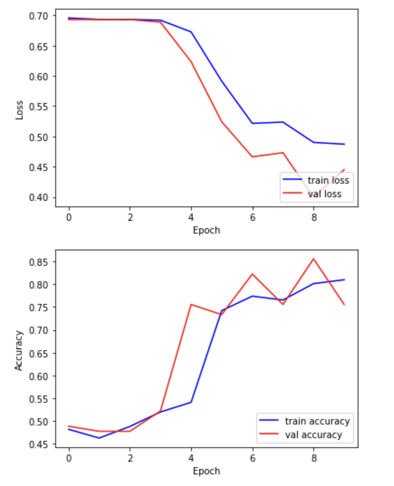

## Compile and train your model

Now that the model architecture is complete, it is ready to be compiled and trained! The difference between our predictions and the true values is the error or "loss". The goal of training is to minimise this loss.

The training process will try to find the optimal model. Using gradient descent, the model's weights are iteratively updated as each batch of data is processed. An epoch means training the neural network with all the training data for one cycle. In an epoch, we use all of the training data once.

```python
# Compile the model defining the 'loss' function type, optimization and the metric.
model.compile(loss='binary_crossentropy', optimizer=custom_adam, metrics=['acc'])

# Save the best model found during training
checkpointer = ModelCheckpoint(filepath='best_model.hdf5', monitor='val_loss',
                               verbose=1, save_best_only=True)

# Now train our network!
# steps_per_epoch = len(dataset_train)//batch_size
hist = model.fit(datagen.flow(dataset_train, labels_train, batch_size=64), 
                 steps_per_epoch=7, 
                 epochs=5, 
                 validation_data=(dataset_val, labels_val), 
                 callbacks=[checkpointer])
```
{: .language-python}

We can now plot the results of the training. Our hope is that "loss" drops over successive epochs, while accuracy increases.

```python
plt.plot(hist.history['loss'], 'b-', label='train loss')
plt.plot(hist.history['val_loss'], 'r-', label='val loss')
plt.ylabel('Loss')
plt.xlabel('Epoch')
plt.legend(loc='lower right')
plt.show()

plt.plot(hist.history['acc'], 'b-', label='train accuracy')
plt.plot(hist.history['val_acc'], 'r-', label='val accuracy')
plt.ylabel('Accuracy')
plt.xlabel('Epoch')
plt.legend(loc='lower right')
plt.show()
```
{: .language-python}

{: width="600px"}

## Evaluating your model on the held-out test set

In this step, we will present the entire test dataset for the model we created, in order to calculate the accuracy of our neural network in a group of images that the model has never seen before.

```python
from tensorflow.keras.models import load_model 

# Open the best model saved during training
best_model = load_model('best_model.hdf5')
print('\nNeural network weights updated to the best epoch.')
```
{: .language-python}

Now that we've loaded the best model, we can evaluate the accuracy on our test data.

```python
# We use the evaluate function to evaluate the accuracy of our model in the test group
print(f"Accuracy in test group: {best_model.evaluate(dataset_test, labels_test, verbose=0)[1]}")
```
{: .language-python}

```
Accuracy in test group: 0.67
```
{: .output}


 


