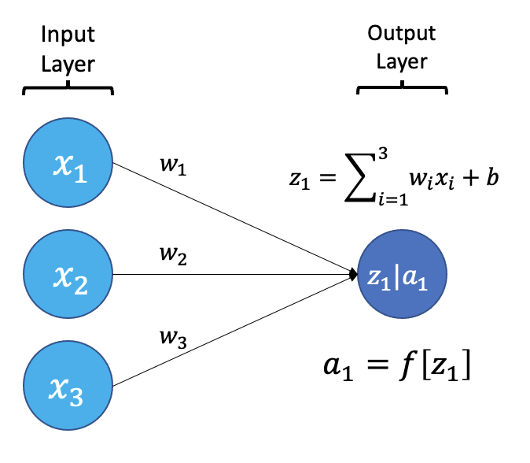
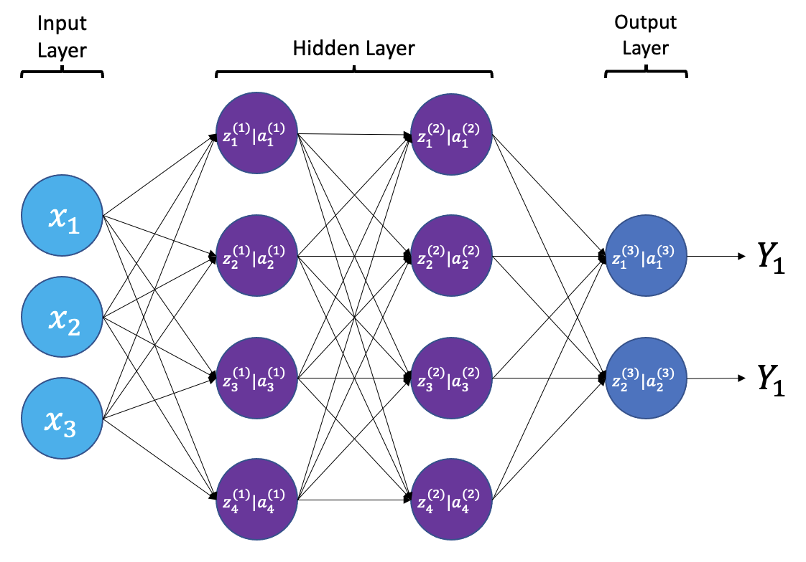

## What is an artificial neural network?

An artificial neural network, or just "neural network", is a broad term that describes a family of machine learning models that are (very!) loosely based on the neural circuits found in biology. 

{: width="600px"}

From a high level, a neural network is a system that takes input values in an "input layer", processes these values with a collection of functions in one or more "hidden layers", and then generates an output in an "output layer". The network has parameters that are systematically tweaked to allow pattern recognition. 

{: width="600px"}

"Deep Learning" is an increasingly popular term used to describe neural networks. When people talk about Deep Learning they are typically referring to more complex network designs often with a large number of hidden layers.

{: width="600px"}

## History

The foundation of artificial neural network algorithms came about in the mid-1900s. Warren McCulloch, a neurophysiologist, and Walter Pitts, a mathematician, are often credited with proposing the model of threshold logic in 1943 that underpins the algorithms used today.

The Perceptron, an early implementation of neural networks, was described by Frank Rosenblatt, a psychologist at Cornell University. This early network suffered from limitations, most significantly that it was only able to perform as a linear classifier, failing where a single hyperplane could not separate classes.

The development and adoption of back propagation - a class of algorithms that improved the training process for neural networks - took place over a long period, eventually leading to a resurgence of interest in neural networks 

[TODO: history]


