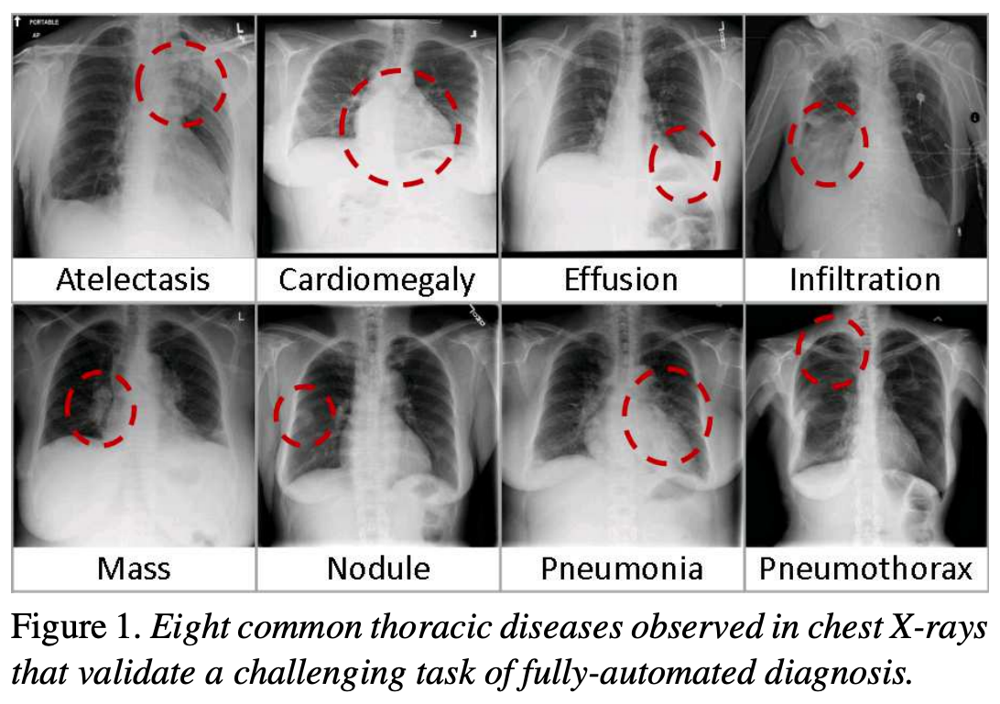

## Chest X-rays

Chest X-rays are frequently used in healthcare to view the heart, lungs, and bones of patients. On an X-ray, broadly speaking, bones appear white, soft tissue appears grey, and air appears black. The images can show details such as:

- Lung conditions, for example pneumonia, emphysema, or air in the space around the lung.
- Heart conditions, such as heart failure or heart valve problems.
- Bone conditions, such as rib or spine fractures
- Medical devices, such as pacemaker, defibrillators and catheters. X-rays are often taken to assess whether these devices are positioned correctly.

In recent years, organisations like the [National Institutes of Health](https://www.nih.gov/news-events/news-releases/nih-clinical-center-provides-one-largest-publicly-available-chest-x-ray-datasets-scientific-community) have released large collections of X-rays, labelled with common diseases. The goal is to stimulate the community to develop algorithms that might assist radiologists in making diagnoses, and to potentially discover other findings that may have been overlooked.

The following figure is from a study by [Xiaosong Wang et al](https://openaccess.thecvf.com/content_cvpr_2017/papers/Wang_ChestX-ray8_Hospital-Scale_Chest_CVPR_2017_paper.pdf). It illustrates eight common diseases that the authors noted could be be detected and even spatially-located in front chest x-rays with the use of modern machine learning algorithms.

{: width="600px"}

## Pleural effusion

Thin membrances called "pleura" line the lungs and facilitate breathing. Normally there is a small amount of fluid present in the pleura, but certain conditions can cause excess build-up of fluid. This build-up is known as pleural effusion, sometimes referred to as “water on the lungs”.  

Causes of pleural effusion vary widely, ranging from mild viral infections to serious conditions such as congestive heart failure and cancer. In an upright patient, fluid gathers in the lowest part of the chest, and this build up is visible to an expert.

For the remainder of this lesson, we will develop an algorithm to detect pleural effusion in chest X-rays. Specifically, using a set of chest X-rays labelled as either "normal" or "pleural effusion", we will train a neural network to classify unseen chest X-rays into one of these classes.

## Loading the dataset

The data that we are going to use for this project consists of 350 "normal" chest X-rays and 350 X-rays that are labelled as showing evidence pleural effusion. These X-rays are a subset of the public NIH ChestX-ray dataset.

> Xiaosong Wang, Yifan Peng, Le Lu, Zhiyong Lu, Mohammadhadi Bagheri, Ronald Summers, ChestX-ray8: Hospital-scale Chest X-ray Database and Benchmarks on Weakly-Supervised Classification and Localization of Common Thorax Diseases, IEEE CVPR, pp. 3462-3471, 2017

Let's begin by loading the dataset.

```python
# The glob module finds all the pathnames matching a specified pattern
from glob import glob
import os

# If your dataset is compressed, unzip with:
# !unzip chest_xrays.zip

# Define folders containing images
data_path = os.path.join("chest_xrays")
effusion_path = os.path.join(data_path, "effusion", "*.png")
normal_path = os.path.join(data_path, "normal", "*.png")

# Create list of files
effusion_list = glob(effusion_path)
normal_list = glob(normal_path)

print('Number of cases with pleural effusion: ', len(effusion_list)) 
print('Number of normal cases: ', len(normal_list))
```
{: .language-python}

```
Number of cases with pleural effusion:  350
Number of normal cases:  350
```
{: .output}




