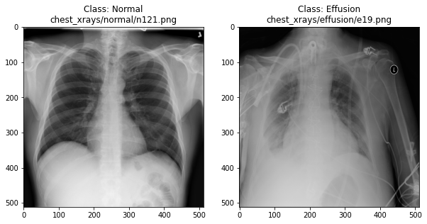
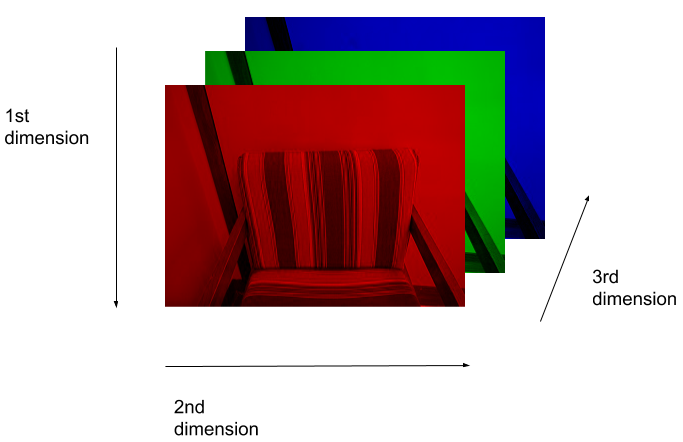
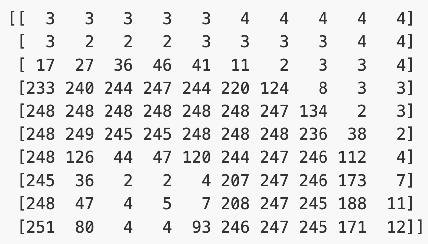
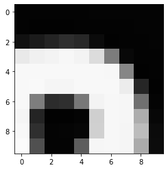
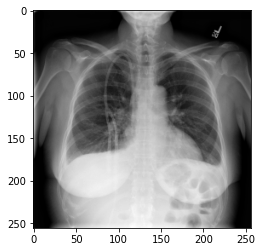

::::::::::::::::::::::::::::::::::::::: objectives

- Visually compare chest X-rays with and without pleural effusion.
- Understand how images are represented as arrays in NumPy.
- Learn to load and preprocess image data for use in machine learning.
- Practice displaying image slices and understanding their pixel-level structure.

::::::::::::::::::::::::::::::::::::::::::::::::::

:::::::::::::::::::::::::::::::::::::::: questions

- How does a chest X-ray with pleural effusion differ from a normal X-ray?
- How is an image represented and manipulated as a NumPy array?
- What steps are needed to prepare images for machine learning?

::::::::::::::::::::::::::::::::::::::::::::::::::

## Visualising the X-rays

In the previous section, we set up a dataset comprising 700 chest X-rays. Half of the X-rays are labelled "normal" and half are labelled as "pleural effusion". Let's take a look at some of the images.

```python
# cv2 is openCV, a popular computer vision library
import cv2
from matplotlib import pyplot as plt 
import random

def plot_example(example, label, loc):
    image = cv2.imread(example)
    im = ax[loc].imshow(image)
    title = f"Class: {label}\n{example}"
    ax[loc].set_title(title)

fig, ax = plt.subplots(1, 2)
fig.set_size_inches(10, 10)

# Plot a "normal" record
plot_example(random.choice(normal_list), "Normal", 0)

# Plot a record labelled with effusion
plot_example(random.choice(effusion_list), "Effusion", 1)
```

{alt='Example X-rays' width="600px"}

## Can we detect effusion?

Run the following code to flip a coin to select an x-ray from our collection.

```python
print("Effusion or not?")

# flip a coin
coin_flip = random.choice(["Effusion", "Normal"])
if coin_flip == "Normal":
    fn = random.choice(normal_list)
else:
    fn = random.choice(effusion_list)

# plot the image
image = cv2.imread(fn)
plt.imshow(image)
```

Show the answer:

```python
# Jupyter doesn't allow us to print the image until the cell has run,
# so we'll print in a new cell.
print(f"The answer is: {coin_flip}!")
```

:::::::::::::::::::::::::::::::::::::::  challenge

## Exercise

Use the coin-flip X-ray viewer to classify 10 chest X-rays.

- Record whether you think each image is "Normal" or "Effusion".
- After viewing the answer, mark whether you were correct.
- Calculate your accuracy: correct predictions ÷ total predictions.

:::::::::::::::  solution

## Solution

Your accuracy is the fraction of correct predictions (e.g. 6 out of 10 = 60%).  
Remember the number! 
Later, we'll use it as baseline for evaluating a neural network.

:::::::::::::::::::::::::

::::::::::::::::::::::::::::::::::::::::::::::::::

## How does a computer see an image?

Consider an image as a matrix in which the value of each pixel corresponds to a number that determines a tone or color. Let's load one of our images:

```python
import numpy as np 

file_idx = 56
example = normal_list[file_idx]
image = cv2.imread(example)

print(image.shape)
```

```output
(512, 512, 3)
```

Here we see that the image has 3 dimensions. The first dimension is height (512 pixels) and the second is width (also 512 pixels).
The presence of a third dimension indicates that we are looking at a color image ("RGB", or Red, Green, Blue).

For more detail on image representation in Python, take a look at the [Data Carpentry course on Image Processing with Python](https://datacarpentry.org/image-processing/). The following image is reproduced from the [section on Image Representation](https://datacarpentry.org/image-processing/03-skimage-images/index.html).

{alt='RGB image' width="600px"}

For simplicity, we'll instead load the images in greyscale.
A greyscale image has two dimensions: height and width.
Greyscale images have only one channel.
Most greyscale images are 8 bits per channel or 16 bits per channel.
For a greyscale image with 8 bits per channel, each value in the matrix represents a tone between black (0) and white (255).

```python
image = cv2.imread(example, cv2.IMREAD_GRAYSCALE)
print(image.shape)
```

```output
(512, 512)
```

Let's briefly display the matrix of values, and then see how these same values are rendered as an image.

```python
# Print a 10 by 10 chunk of the matrix
print(image[35:45, 30:40])
```

{alt='Example greyscale numpy array' width="400px"}

```python
# Plot the same chunk as an image
plt.imshow(image[35:45, 30:40], cmap='gray', vmin=0, vmax=255)
```

{alt='Example greyscale image' width="400px"}

## Image pre-processing

In the next section, we'll be building and training a model. Let's prepare our data for the modelling phase. For convenience, we'll begin by loading all of the images and corresponding labels and assigning them to a list.

```python
# create a list of effusion images and labels
dataset_effusion = [cv2.imread(fn, cv2.IMREAD_GRAYSCALE) for fn in effusion_list]
label_effusion = np.ones(len(dataset_effusion))

# create a list of normal images and labels
dataset_normal = [cv2.imread(fn, cv2.IMREAD_GRAYSCALE) for fn in normal_list]
label_normal = np.zeros(len(dataset_normal))

# Combine the lists
dataset = dataset_effusion + dataset_normal
labels = np.concatenate([label_effusion, label_normal])
```

### Downsampling

X-ray images are often high resolution, which can be useful for detailed clinical interpretation. However, for training a machine learning model, especially in an educational or prototype setting, using smaller images can reduce:

- Memory usage: smaller images require less RAM and storage.
- Computation time: smaller images train faster.
- Overfitting risk: smaller inputs reduce the number of parameters and complexity.

For these reasons, we will downsample each image from 512×512 pixels to 256×256 pixels. This still preserves important features (like fluid in the lungs) while reducing the computational cost.

```python
# Downsample the images from (512,512) to (256,256)
dataset = [cv2.resize(img, (256,256)) for img in dataset]

# Check the size of the reshaped images
print(dataset[0].shape)
```

```output
(256, 256)
```

### Standardisation

Before training a model, it's important to scale input data. A common approach is standardization, which adjusts the pixel values so that each image has zero mean and unit variance. This helps neural networks learn more effectively by ensuring that the input data is centered and scaled.

```python
# Standardize the data
# For each image: subtract the mean and divide by the standard deviation
for i in range(len(dataset)):
  dataset[i] = (dataset[i] - np.mean(dataset[i])) / np.std(dataset[i])
```

### Reshaping

Finally, we'll convert our dataset from a list to an array. We are expecting it to be (700, 256, 256), representing 700 images (350 effusion and 350 normal), each with dimensions 256×256.

```python
dataset = np.asarray(dataset, dtype=np.float32)
print(f"Matrix Dimensions: {dataset.shape}")
```

```output
(700, 256, 256)
```

:::::::::::::::::::::::::::::::::::::::  challenge

## Exercise

Pick any grayscale image from your dataset (hint: `dataset[idx]`) and inspect the following:

A) What is the new shape of the image array?  
B) What are the mean and standard deviation of the pixel values?  

:::::::::::::::  solution

## Solution

A) Shape after resizing: `dataset[0].shape` (256, 256)
B) The mean is 0 (`dataset[0].mean()`) and the standard deviation is 1 (`dataset[0].std()`)

:::::::::::::::::::::::::

:::::::::::::::::::::::::::::::::::::::

We could plot the images by indexing them on `dataset`, e.g., we can plot the first image in the dataset with:

```python
idx = 0
vals = dataset[idx].flatten()
plt.imshow(dataset[idx], cmap='gray', vmin=min(vals), vmax=max(vals))
```

{alt='Example greyscale image' width="400px"}


:::::::::::::::::::::::::::::::::::::::: keypoints

- X-ray images can be loaded and visualized using Python libraries like OpenCV and NumPy.
- Images are stored as 2D arrays (grayscale) or 3D arrays (RGB).
- Visual inspection helps us understand how disease features appear in imaging data.
- Preprocessing steps like resizing and standardization prepare data for machine learning.

::::::::::::::::::::::::::::::::::::::::::::::::::


