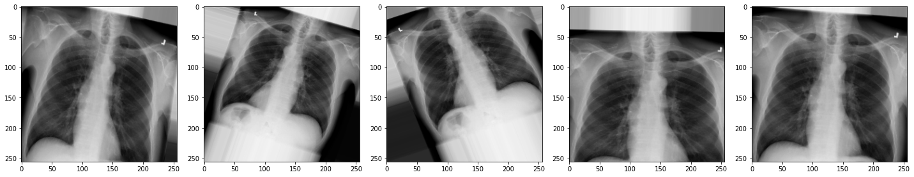

::::::::::::::::::::::::::::::::::::::: objectives

- Split the dataset into training, validation, and test sets.
- Prepare image and label arrays in the format expected by TensorFlow.
- Apply basic image augmentation to increase training data diversity.
- Understand the role of data preprocessing in model generalization.

::::::::::::::::::::::::::::::::::::::::::::::::::

:::::::::::::::::::::::::::::::::::::::: questions

- Why do we divide data into training, validation, and test sets?
- What is data augmentation, and why is it useful for small datasets?
- How can random transformations help improve model performance?

::::::::::::::::::::::::::::::::::::::::::::::::::


## Partitioning into training and test sets

As we have done in previous projects, we will want to split our data into subsets for training and testing. The training set is used for building our model and our test set is used for evaluation.

To ensure reproducibility, we should set the random state of the splitting method. This means that Python's random number generator will produce the same "random" split in future.

```python
from sklearn.model_selection import train_test_split

# Our Tensorflow model requires the input to be:
# [batch, height, width, n_channels]
# So we need to add a dimension to the dataset and labels.
# 
# Ellipsis (...) is shorthand for selecting with ":" across dimensions. 
# np.newaxis expands the selection by one dimension.
dataset = dataset[..., np.newaxis]
labels = labels[..., np.newaxis]

# Create training and test sets
dataset_train, dataset_test, labels_train, labels_test = train_test_split(dataset, labels, test_size=0.15, random_state=42)

# Create a validation set
dataset_train, dataset_val, labels_train, labels_val = train_test_split(dataset_train, labels_train, test_size=0.15, random_state=42)

print("No. images, x_dim, y_dim, colors) (No. labels, 1)\n")
print(f"Train: {dataset_train.shape}, {labels_train.shape}")
print(f"Validation: {dataset_val.shape}, {labels_val.shape}")
print(f"Test: {dataset_test.shape}, {labels_test.shape}")
```

```output
No. images, x_dim, y_dim, colors) (No. labels, 1)

Train: (505, 256, 256, 1), (505, 1)
Validation: (90, 256, 256, 1), (90, 1)
Test: (105, 256, 256, 1), (105, 1)
```

## Data Augmentation

We have a small dataset, which increases the chance of overfitting our model. If our model is overfitted, it becomes less able to generalize to data outside the training data.

To artificially increase the size of our training set, we can use `ImageDataGenerator`. This function generates new data by applying random transformations to our source images while our model is training.

```python
from tensorflow.keras.preprocessing.image import ImageDataGenerator

# Define what kind of transformations we would like to apply
# such as rotation, crop, zoom, position shift, etc
datagen = ImageDataGenerator(
    rotation_range=0,
    width_shift_range=0,
    height_shift_range=0,
    zoom_range=0,
    horizontal_flip=False)
```

For the sake of interest, let's take a look at some examples of the augmented images!

```python
# specify path to source data
path = os.path.join("chest_xrays")
batch_size=5

val_generator = datagen.flow_from_directory(
        path, color_mode="rgb",
        target_size=(256, 256),
        batch_size=batch_size)

def plot_images(images_arr):
    fig, axes = plt.subplots(1, 5, figsize=(20,20))
    axes = axes.flatten()
    for img, ax in zip(images_arr, axes):
        ax.imshow(img.astype('uint8'))
    plt.tight_layout()
    plt.show()

augmented_images = [val_generator[0][0][0] for i in range(batch_size)]
plot_images(augmented_images)
```

{alt='X-ray augmented' width="1200px"}

The images look a little strange, but that's the idea! When our model sees something unusual in real-life, it will be better adapted to deal with it.

Now we have some data to work with, let's start building our model.


:::::::::::::::::::::::::::::::::::::::: keypoints

- Data should be split into separate sets for training, validation, and testing to fairly evaluate model performance.
- TensorFlow expects input images in the shape (batch, height, width, channels).
- Data augmentation increases the variety of training data by applying random transformations.
- Augmented images help reduce overfitting and improve generalization to new data.

::::::::::::::::::::::::::::::::::::::::::::::::::


