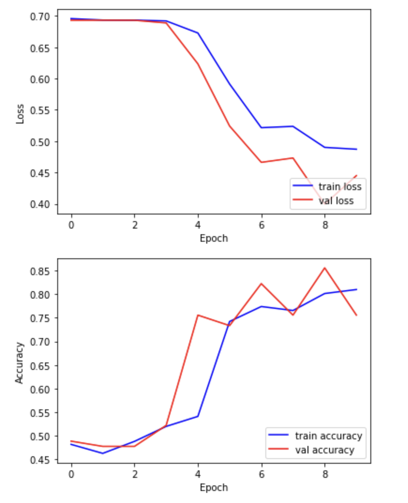

::::::::::::::::::::::::::::::::::::::: objectives

- Compile a neural network with a suitable loss function and optimizer.
- Train a convolutional neural network using batches of data.
- Monitor model performance during training using training and validation loss and accuracy.
- Evaluate a trained model on a held-out test set.

::::::::::::::::::::::::::::::::::::::::::::::::::


:::::::::::::::::::::::::::::::::::::::: questions

- How is a neural network trained to make better predictions?
- What do training loss and accuracy tell us?
- How do we evaluate a model’s performance on unseen data?

::::::::::::::::::::::::::::::::::::::::::::::::::


## Compile and train your model

Now that we've defined the architecture of our neural network, the next step is to compile and train it. 

### What does "compiling" a model mean?

Compiling sets up the model for training by specifying:

- A loss function, which measures the difference between the model’s predictions and the actual labels.
- An optimizer, such as gradient descent, which adjusts the model's internal weights to minimize the loss.
- One or more metrics, such as accuracy, to evaluate performance during training.

### What happens during training?

Training is the process of finding the best set of weights to minimize the loss. This is done by:

- Making predictions on a batch of training data.
- Comparing those predictions to the true labels using the loss function.
- Adjusting the weights to reduce the error, using the optimizer.

### What are batch size, steps per epoch, and epochs?

- Batch size is the number of training examples processed together before updating the model's weights. 
  - Smaller batch sizes use less memory and may generalize better but take longer to train.
  - Larger batch sizes make faster progress per step but may require more memory and can sometimes overfit.
- Steps per epoch defines how many batches the model processes in one epoch. A typical setting is: `steps_per_epoch = len(dataset_train) // batch_size`
- Epochs refers to how many times the model sees the entire training dataset.

Choosing these parameters is a tradeoff between speed, memory usage, and performance. You can experiment to find values that work best for your data and hardware.

```python
import time
from tensorflow.keras import optimizers
from tensorflow.keras.callbacks import ModelCheckpoint

# Define the network optimization method. 
# Adam is a popular gradient descent algorithm
# with adaptive, per-parameter learning rates.
custom_adam = optimizers.Adam()

# Compile the model defining the 'loss' function type, optimization and the metric.
model.compile(loss='binary_crossentropy', optimizer=custom_adam, metrics=['acc'])

# Save the best model found during training
checkpointer = ModelCheckpoint(filepath='best_model.keras', monitor='val_loss',
                               verbose=1, save_best_only=True)

# Training parameters
batch_size = 16
epochs=10

# Start the timer
start_time = time.time()

# Now train our network!
# steps_per_epoch = len(dataset_train)//batch_size
hist = model.fit(datagen.flow(dataset_train, labels_train, batch_size=batch_size),
                 epochs=epochs, 
                 validation_data=(dataset_val, labels_val), 
                 callbacks=[checkpointer])

# End the timer
end_time = time.time()
elapsed_time = end_time - start_time
print(f"Training completed in {elapsed_time:.2f} seconds.")
```

We can now plot the results of the training. "Loss" should drop over successive epochs and accuracy should increase.

```python
plt.plot(hist.history['loss'], 'b-', label='train loss')
plt.plot(hist.history['val_loss'], 'r-', label='val loss')
plt.ylabel('Loss')
plt.xlabel('Epoch')
plt.legend(loc='lower right')
plt.show()

plt.plot(hist.history['acc'], 'b-', label='train accuracy')
plt.plot(hist.history['val_acc'], 'r-', label='val accuracy')
plt.ylabel('Accuracy')
plt.xlabel('Epoch')
plt.legend(loc='lower right')
plt.show()
```

{alt='Training curves' width="600px"}

:::::::::::::::::::::::::::::::::::::::  challenge

## Exercise

Examine the training and validation curves.

A) What does it mean if the training loss continues to decrease, but the validation loss starts increasing?  
B) Suggest two actions you could take to reduce overfitting in this situation.  
C) Bonus: Try increasing the dropout rate in your model. What happens to the validation accuracy?

:::::::::::::::  solution

## Solution

A) If the training loss decreases while the validation loss increases, the model is **overfitting** — it’s learning the training data too well and struggling to generalize to unseen data.

B) You could:
- **Increase regularization** (e.g. by raising the dropout rate)
- **Add more training data**
- **Use data augmentation**
- **Simplify the model** to reduce capacity

C) Increasing dropout may lower performance slightly but improve generalization. Always compare the training and validation accuracy/loss to decide.

:::::::::::::::::::::::::

::::::::::::::::::::::::::::::::::::::::::::::::::

## Batch normalization

[Batch normalization](https://keras.io/api/layers/normalization_layers/batch_normalization/) is a technique that standardizes the output of a layer across each training batch. This helps stabilize and speed up training.

It works by:

- Subtracting the batch mean
- Dividing by the batch standard deviation
- Applying a learnable scale and shift

You typically insert `BatchNormalization()` after a convolutional or dense layer, and before the activation function:

```python
x = Conv2D(32, kernel_size=3, padding='same')(x)
x = BatchNormalization()(x)
x = Activation('relu')(x)
```

Benefits can include:

- Faster training
- Reduced sensitivity to weight initialization
- Helps prevent overfitting

:::::::::::::::::::::::::::::::::::::::  challenge

A) Try inserting a BatchNormalization() layer after the first convolutional layer in your model, and re-run the training. Compare:

- Training time
- Accuracy
- Validation performance

What changes do you notice?

:::::::::::::::  solution

A) Adding batch normalization can improve training stability and accuracy. Find this line in your model:

```python
x = Conv2D(filters=8, kernel_size=3, padding='same', activation='relu')(inputs)
```

Split it into two lines, and insert `BatchNormalization()` before the activation:

```python
x = Conv2D(filters=8, kernel_size=3, padding='same')(inputs)
x = BatchNormalization()(x)
x = Activation('relu')(x)
```

You may notice:

- Smoother training curves
- Higher validation accuracy
- Slightly faster convergence

Remember to retrain your model after making this change.

:::::::::::::::::::::::::

:::::::::::::::::::::::::::::::::::::::

## Choosing and modifying the architecture

There is no single “correct” architecture for a neural network. The best design depends on your data, task, and computational constraints. Here is a systematic approach to designing and improving your model architecture:

### Start simple

Begin with a basic model and verify that it can learn from your data. It is better to get a simple model working than to over-complicate things early.

### Use proven patterns

Borrow ideas from successful models:

- LeNet-5: good for small grayscale images.
- VGG: uses repeated 3×3 convolutions and pooling.
- ResNet or DenseNet: useful for deep networks with skip connections.

### Tune hyperparameters systematically

To improve performance in a structured way, try:

- Manual tuning: Change one variable at a time (e.g., number of filters, dropout rate) and observe its effect on validation performance.
- Grid search: Define a grid of parameters (e.g., filter sizes, learning rates, dropout values) and test all combinations. This is slow but thorough.
- Automated tuning: Use tools like [Keras Tuner](https://keras.io/keras_tuner/) to automate the search for the best architecture.

### Evaluate and iterate

Use validation performance to guide decisions:

- Does adding filters or layers improve accuracy?
- Is the model overfitting (training accuracy much higher than validation)?
- Is training time manageable?

### Use regularization

To reduce overfitting, consider:

- Dropout layers
- Data augmentation
- Early stopping

## Evaluating your model on the held-out test set

In this step, we present the unseen test dataset to our trained network and evaluate the performance.

```python
from tensorflow.keras.models import load_model 

# Open the best model saved during training
best_model = load_model('best_model.keras')
print('\nNeural network weights updated to the best epoch.')
```

Now that we've loaded the best model, we can evaluate the accuracy on our test data.

```python
# We use the evaluate function to evaluate the accuracy of our model in the test group
print(f"Accuracy in test group: {best_model.evaluate(dataset_test, labels_test, verbose=0)[1]}")
```

```output
Accuracy in test group: 0.80
```

:::::::::::::::::::::::::::::::::::::::: keypoints

- Neural networks are trained by adjusting weights to minimize a loss function using optimization algorithms like Adam.
- Training is done in batches over multiple epochs to gradually improve performance.
- Validation data helps detect overfitting and track generalization during training.
- The best model can be selected by monitoring validation loss and saved for future use.
- Final performance should be evaluated on a separate test set that the model has not seen during training.

::::::::::::::::::::::::::::::::::::::::::::::::::


